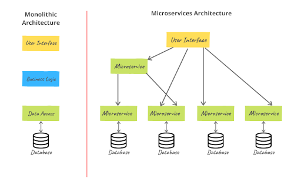
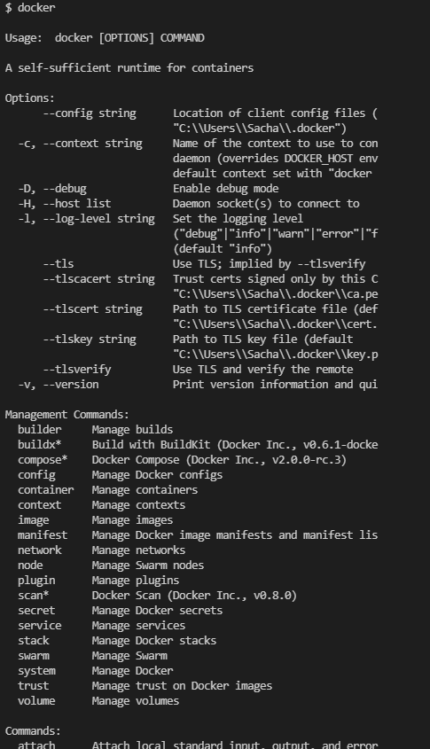
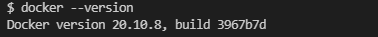
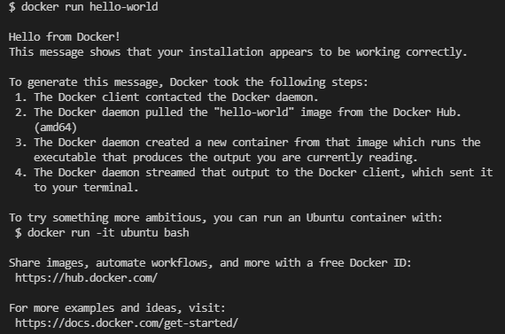
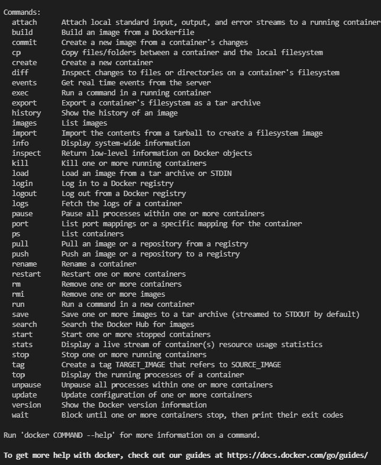
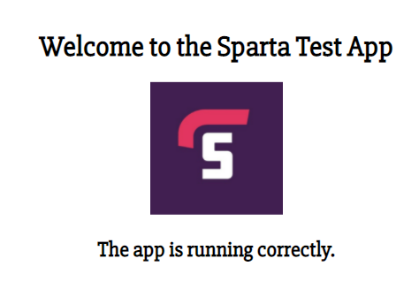

# Microservices Architecture vs Monolith


- [Microservices Architecture vs Monolith](#microservices-architecture-vs-monolith)
  - [What is containerisation](#what-is-containerisation)
- [Docker](#docker)
  - [What is Docker?](#what-is-docker)
- [Benefits](#benefits)
  - [Docker Installation](#docker-installation)
    - [Requirements](#requirements)
    - [Installation](#installation)
    - [To Check Installation](#to-check-installation)
    - [Create an account](#create-an-account)
    - [Today](#today)
    - [Docker Commands](#docker-commands)
    - [Naming convention for images](#naming-convention-for-images)
    - [Removing images](#removing-images)
    - [Checking container state](#checking-container-state)
    - [Difference between stopped and removed](#difference-between-stopped-and-removed)
    - [Interact with running Container](#interact-with-running-container)
    - [Let's move onto nginx](#lets-move-onto-nginx)
  - [Dockerfile](#dockerfile)
    - [Let's create a Micro-service for our Node-App with Docker](#lets-create-a-micro-service-for-our-node-app-with-docker)

## What is containerisation
- Packaging services together in a container
# Docker

## What is Docker?
- Open source
- PaaS (platform as a service)
- Containerisation platform

# Benefits
- Faster than VMs
- Light-weight
- User-friendly
- Isolates 
- Uses fewer resources


## Docker Installation
https://docs.docker.com/desktop/windows/install/

### Requirements
- WSL 2 backend

### Installation
- Go to above link
- Click `Download Docker Desktop for Windows`
- Once downloaded, click the exe file to run the installer
- Select the Install Required components for WSL 2 option
- Go through the installation instructions
- At the end, it should ask to restart your computer

### To Check Installation
In the terminal:
- `docker`



- `docker version`



### Create an account
- Create an account on DockerHub
https://hub.docker.com/account/confirm-email/42542e657ad9500c9b1e616ca4abe8d23c975b87/
- Sign in on Docker Desktop


In terminal:
- `docker pull hello-world`
- `docker images`
- `docker run hello-world`



### Today
`docker version`
`docker images`

```
Unable to find image 'hell-world:latest' locally
docker: Error response from daemon: pull access denied for hell-world, repository does not exist or may require 'docker login': denied: requested access to the resource is denied.
See 'docker run --help'.
```
- Means that it doesn't exist


### Docker Commands
- `docker pull name_of_the_image`
- `docker run name_of_the_image`
- `docker build -t sachadorf/sre_sacha:v1`
- `docker push name_of_the_image`

### Naming convention for images
- `name_of_account/name_of_image`
- let's create an example of new image with correct naming convention
- `sachadorf/sre_docker_app:v1`

### Removing images
- `docker rmi name_of_image` (if in use, e.g. running in background, need to use -f tag to force remove it) `docker rmi name_of_image -f`

- Let's see an example off an image that is already available on DockerHub/registry
- Image called `ghost`
- `docker run -d -p 2368:2368 ghost` (port mapping -> port of container: port of localhost)



### Checking container state
- `docker ps` or `docker ps -a`
- `docker stop containerid`
- `docker rm 13569184bfab -f`

### Difference between stopped and removed
- Stopped state still holds the same data available
- Removed deletes it completely

### Interact with running Container
- alias docker="winpty docker"
- `docker exec -it container_id sh` - Takes us into the container shell


- `docker run -d -p 4000:4000 docs/docker.github.io`

### Let's move onto nginx
- `docker run -d -p 80:80 nginx`


- `docker exec -it ___ sh`
- `apt-get update -y`
- `apt-get install nano`
- `cd usr/share/nginx/html`
- `nano index.html`
- Change the heading to "Welcome to Sacha's Page at Sparta Global!"
- `docker stop container_id` - Website will not display
- `docker start container_id` - `Website will display with the changes you made (saves state)
- `docker rm container_id` - Removes container
- `docker run -d -p 80:80 nginx` - Will load nginx, but without the changes you made


Create a container with nginx image
- docker run -d -p 80:80 nginx
Create an index.html file on localhost
- `nano index.html`
Copy the index.html file to the default location of nginx container /usr/share/nginx/html
`sudo docker cp /SRE_Docker/index.html  (container_id):/usr/share/nginx/html`
docker cp (current_path_of_file) (container_id):/(path_of_destination_you_want_to_copy_file_to)
e.g. docker cp index.html 81177265bfdc://usr/share/nginx/html
commit the changes to the images
- docker commit 81177265bfdc sachadorf/sre_customised_nginx
- docker push sachadorf/sre_customised_nginx


build your own images called accid/sre_customised_nginx
share you images name in the chat.
docker run -d -p 80:80 name of your image

docker commit c3f279d17e0a  svendowideit/testimage:version3

## Dockerfile
- `nano Dockerfile`

```
# BUILDING OUR OWN IMAGE

# Choose the image
FROM nginx

# Label Maintainer (Author label)
LABEL MAINTAINER=SDorf@spartaglobal.com
# Create a container

# Copy the index.html file from host machine to container
COPY . /usr/share/nginx/html

# port 80
EXPOSE 80

# CMD TO LAUNCH THE NGINX WEB SERVER
CMD ["nginx", "-g", "daemon off;"]
```

- `docker build -t sachadorf/sre_nginx_test:v1 .`
- `docker run -d -p 80:80 sachadorf/sre_nginx_test:v1`
- `docker push sachadorf/sre_nginx_test:v1`
 
### Let's create a Micro-service for our Node-App with Docker
- We will build an image for the app
- Select the correct image for node `node`
- `LABEL`
- COPY dependencies from localhost to container `app /default location
- Copy package.json files
- `RUN npm install

- `docker build -t sachadorf/sre_node_app:v1 .`
- `docker run -d -p 80:3000 sachadorf/sre_node_app:v1`
- type localhost into your browser and you should see this page:

